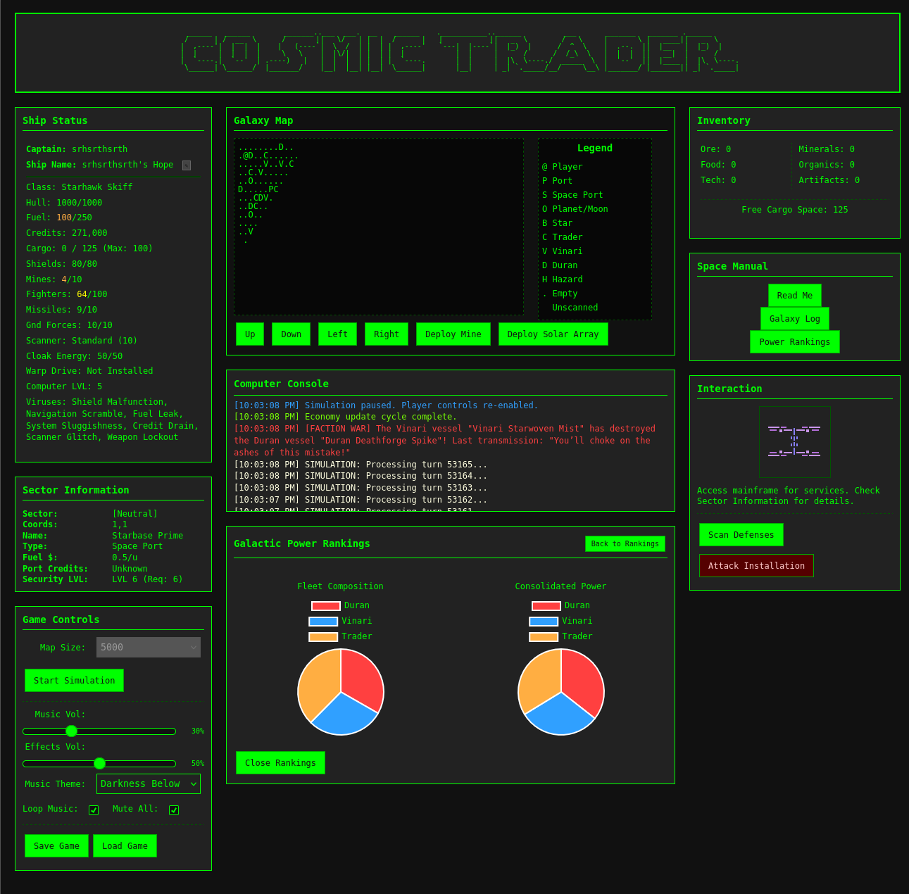

# Cosmic Trader

This is a web-based game based loosely on the Yankee Trader and TradeWars 2002 BBS Doors games.

I will be trying to include a lot of the game features from both and combine them into a basic 
web based game. Right now its in early stages and I would like to get a single-player aspect completed
before attempting to add any multiplayer aspect.

Current Game Features:
- **Port Trading**: Buy/sell commodities (ore, food, tech) and exotics (minerals, organics, artifacts) with dynamic prices
- **Sector Navigation**: 50x100 galaxy grid with fuel-based movement
- **Economic Events**: Boom/bust cycles, strikes, and price fluctuations with profit guarantees
- **Planets**: Procedural generation, scanning (1 fuel), mining (5 fuel), claiming, colonization, invasion
- **Combat System**: Ship-to-ship battles with fighters, missiles, mines, shields, and hull damage
- **NPC AI**: Autonomous faction ships that trade profitably (+3-4M credits net), mine planets, upgrade equipment
- **Ship Classes**: 15+ ships across 3 factions with upgradeable systems (hull, shields, weapons, scanners, warp)
- **Banking**: Interest-bearing accounts with PIN security
- **Faction System**: Traders, Duran, Vinari with territories and relationships
- **Port Ownership**: Capture ports for trading advantages and defense
- **Lottery**: Random credit rewards
- **Rankings**: Power-based leaderboards
- **Accessibility**: Text-to-speech support (needs to be re-worked - disabled)

Advanced Mechanics:
- **NPC Trading**: Strategic buy-low-sell-high with full inventory management
- **Dynamic Economy**: Price clamps ensure profitable trading (sell ≤ buy prices)
- **Equipment Upgrades**: 40-60% success rates at spaceports
- **Planet Mining**: Resource extraction with fuel costs
- **Faction AI**: Upgrade priorities (Duran: combat, Vinari: tech, Traders: cargo)

Things I would like in the game but not sure if I can make it happen:
- Port-to-Port trading mechanism (ie: port pair trading)
- Penality system when  fail at stealing/hacking (ie: fines, viruses injected against ship)
- Robbing players/npc (currently only ports can have this done)
- Aliens/NPCs that will actively move on the map and perform actions while you play, having the NPCs actively trying to get better is very important to me
- Need a database implementation, right now all game mechanics for testing is help in browser local storage
- Chat mechanics or mail system, like in old tradewars
- Implement a planet system for capturing, building up production, leveling planet for defensive/offensive benefits
- Try to introduce new weapons/defensive mechanics
- Simple questing system
- Galaxy event system
- Reporting system (ie: players/npc, factions, ports, planets, net worth)
- Clan/Faction system
- Possibly explore better 'visual map system'

Things that will not be in the game:
- Scripting actions (like in old TW)
- Game will not have much in the way of graphics, but I would be open to suggestion and thoughts after the majority of features are in
